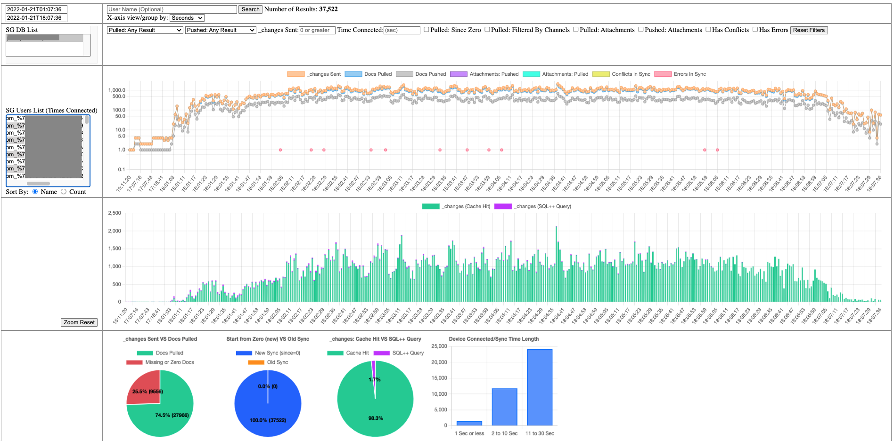

# sg-log-reader-demo
Version 2.0



## Why

Couchbase Mobile 2.x and greater now communicates via WebSockets.

This means it easier to track a mobile user's replication to see "Why is sync is slow?" or "Why is it not syncing?". 

#### Future - More
In the future it will do more to understand other things going on inside Sync Gateway more to debug why there are sync issues.

## What
The sg-log-reader tool takes your SG log file and parses them to:

* Aggregate

* Count 

* Sum

* and More 

It takes the above information and puts it into a Couchbase Server bucket to query for a built-in web dashboard (ABOVE IMAGE).

## How

#### Process
You just need to:

 1. Pick a `sg_info.log` for the python script to process.
 2. Have access to a CB Cluster for the script to insert data into.
 3. Open up the included index.html via (`http://127.0.0.1:8080`)
 
#### Result
 It will:
   Output all the Sync Gateway's databases
   Output a list of names of all device users.
   Output a graph of all the synced that happen from the: Begin & Date you picked.
   You can pick a specific user to drill down to.
   you can pick a specific sync for a specific user.


### Requirements:

- Python 3.6 or greater

- Couchbase Bucket (named: `sg-log-reader`)

- Couchbase Cluster 7.x with Index and Query Service

- Create the below indexes.

```sql
CREATE INDEX `sgProcessErrorsEpoch_v4` ON `sg-log-reader`(`dtFullEpoch`,`import`,`dcp`,`query`,`sgDb`,`ws`,`gen`) WHERE (`docType` = "sgErrors")
```

```sql
CREATE INDEX `userSyncFinderEpoch_v7` ON `sg-log-reader`(`dtFullEpoch`,`user`,`sgDb`,`dtDiffSec`,`sentCount`,`errors`,`tRow`,`since`,array_length(`filterBy`),`conflicts`,`pushAttCount`,`pullAttCount`,`pushCount`,`qRow`,`cRow`,`blipC`) WHERE ((`docType` = "byWsId") and (`orphane` = false))
```

***NOTE:*** if you put the data in a different bucket then `sg-log-reader` change the above index definitons to match your bucket name.


#### Install 

Python Virtual Environment:
[https://pypi.org/project/pipenv/](https://pypi.org/project/pipenv/)

or 

Homebrew install

```console
# brew install pipenv
```


## Running / Using It
Running the code by creating a Python Virtual Environment

```console
# pipenv shell 
```


Install some Python libaries that will run in in your virtual environment.

```console
# pipenv install couchbase
# pipenv install flask
# pipenv install icecream
```

Update the config.json with:

 ```json
 {
"file-to-parse":"sg_info.log",	    ///   "/path/to/file/here/sg_info.log" 
"cb-cluster-host":"127.0.0.1",      /// CB SERVER Hostname HERE
"cb-bucket-name":"sg-log-reader",   /// CB Bucket Name HERE: sg-log-reader._default._default
"cb-bucket-user":"Administrator",   ///  CB Bucket RBAC Username
"cb-bucket-user-password":"fujiofujio", /// CB Bucket RBAC Password
"cb-expire":86400,                 ///Optional: Data will expire in 24 hours
"log-name":"test-today-node-0",  ///Optional: if you process multiple SG nodes you can tag the logs source here.
"dt-log-line-offset":0,          ///Optional: Sometime Windows Machine add address spaces in the timestamp in front.
"debug":false
}
 ```

Let's Parse the log file. Run the command below in the directory of the sg-log-reader downloaded folder

```console
 # python3 sg-log-reader.py config.json
```

 The output should look like this below:


```console
Starting - Reading Data File:  2023-11-05 09:43:35.072700
Number - Lines in log file:  766836
Number - WebSocket Connections:  18585
Done - Reading Data File:  2023-11-05 09:43:37.112688
Starting - Per wsId :  2023-11-05 09:43:37.112698
Done - Per wsId :  2023-11-05 09:48:19.576021
```

**NOTE:** a `sg_info.log` that is large , 100MB+ and/or more have a lot of unique WebSocket information will take a long time to process.

After you get the above `Done - Per wsId: ...` data should be in your Couchbase bucket.

#### Dashboard

To get to a dashboard to see stats you'll run a local python Flask Web Server. Run the Command below to start the web server.

```console
# python3 app.py config.json
```

OUTPUT should look something like this.

```console
 * Serving Flask app 'app'
 * Debug mode: off
WARNING: This is a development server. Do not use it in a production deployment. Use a production WSGI server instead.
 * Running on all addresses (0.0.0.0)
 * Running on http://127.0.0.1:8080
 * Running on http://192.168.0.193:8080
```

Now open up a Web Browser and go to: [http://127.0.0.1:8080](http://127.0.0.1:8080)


The dashboard will auto pre-populate the newest datetime in the box , TO DateTime input box and an hour back DateTime in the FROM input box. It will pre select a SG DB too.

Just click the button(`Search`) you should get some results.

#### Chart Navigating:

You can click on the line charts and PAN left or right by dragging it. If you hold down the `SHIFT` and select in the chart it will create a `zoom` box for you pick a section of the chart your more interesting in. There is a `Zoom Reset` button on the left. The two line charts will adjust themselves to the new x-axis on zoom and/or pan too.

#### Picking Users:

##### User List:

On the left it will show you all the SG users who made connections in the DatesTime window selected above plus how many times they connected in that time window. 
You can sort the list alphabetically(default) or by most number of connections.

##### Just Click Username:
Just click the name of the user and it will pre populate the filter by username input box ,above, and then just click `Search` to filter and populate charts and stats for that user only.

***note*** When you pick and `Search` by a users the chart will plot `All Entries` on the x-axis regardless if you didn't change the `view by` dropdown value.

##### User Details:

Once you `Search` by a user on the bottom it will show you all the indivudal replication events for that user for that DateTime. If you click on the row it will show the full raw SG log for the WebSocket ID.


### FAQ
**Q:** What version of Python do I need?

**A:** Python 3.6+ 

**Q:** Is there any configuration to the script?

**A:** Yes, there is a config.json file that you can update with things like credentials to a Couchbase bucket


**Q:** What version of Sync Gateway logs will it work on?

**A:** Its been testing with Sync Gateway version 2.8.x to 3.0.1. Sorta works with 3.1.x


### Common Reasons Why Docs Don't Sync
1. The user ,at the time of sync, was not assigned access to read a particular channel(s) the document(s) are on.

2. The user roles was not set correctly or role was deleted

3. Document was not on the channel(s) when the user last syncs

4. Document is set on the channels in the beginning , but later or in the middle of multipe updates the channel was unassigend
    a. json element with channel info is missing during document updates

5. There is a conflict in the document and the device decides not to sync it. Rules on [default conflict resolution in CBL](https://docs.couchbase.com/couchbase-lite/current/c/conflict.html#automatic-conflict-resolution)

6. Couchbase Lite Deletes/Purges/Expires(TTLs) docs locally , but the next time CBL syncs the docs at SG never changed.


### Not So Common Reasons Why Docs Don't Sync

1. Starting multiples of the same exact replicator at once leading to a fight by the replicators on getting/setting the same checkpoints.


2. Load Balancer or Security Device killing the Websocket connection before the 5 minute keepalive is sent from CBL.

3. Deleting Sync Gateway users while the user is replicating, but re-creating the same user later.

4. Starting to many replicators on the device. Example: You have a CBL replicator per channel , but there are 20-80 channels.


### NOTES

-- Its advised to "Flush" the Couchbase Bucket for each new SG environments you process.

-- Docs is the `sg-log-reader` bucket by default have a TTL(expire) in 24 hours. You can change the setting in the `config.json` file.

-- Logs from a Sync Gateway machine running on MS Windows might have issues as its timestamps in the logs might have a different format thus effecting the processing of Sync Gateway file.


Works on My Computer Tested & Certified ;-)