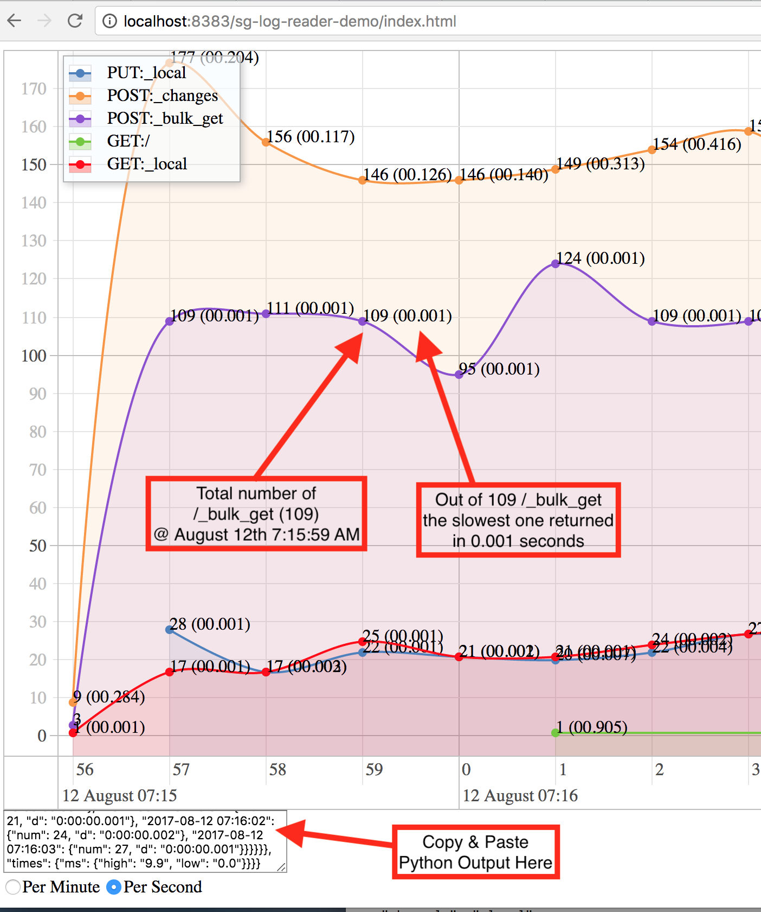

# sg-log-reader-demo

Tired of combing through Sync Gateway logs? .... OUCH!

Trying to find the _changes that is just too slow?  ... Yes sir e

Just use the new and improved SG-LOG-READER and parse through those pesky logs lickety split.





**HOW TO USE**

**RUNNING**

-Just run the pythen script and tell it where the sync_gateway_error.log is
```
#/path/to/sg-log-reader.py /path/to/your/sync_gateway_error.log > test.json
```
-Open the test.json file and copy/paste that JSON

-Open index.html with a browser or start a local web server with the included index.html 

-Paste that JSON into the textarea box and click "Make Graph".

**Timestamp log offset**

Sometimes the Sync Gateway logs have additional timestamps or namespacing in front the the Sync Gateway's own time stamp in the log. 

EXAMPLE BELOW

`16:11:47.050535 2017-11-09T16:11:47.050-06:00` 

In the above `16:11:47.050535` is not needed, but `2017-11-09T16:11:47.050` is needed.
So to get the Sync Gateway created timestamp you can set a offset to get to `2017-11-09T16:11:47.050`.
```
logTimeOffset = 0  to logTimeOffset = 16
```
You have to change it in the python file itself sg-log-reader.py on line 15.


**FAQ**

**Q:** What do I need to use this fantansic tool?


**A:**

-Python 2.6+ installed 

-Local Web Server ,example [MAMP](https://www.mamp.info/en/) , for the index.html file or open index.html with a browser.


#Works on My Computer Tested & Certified ;-)
