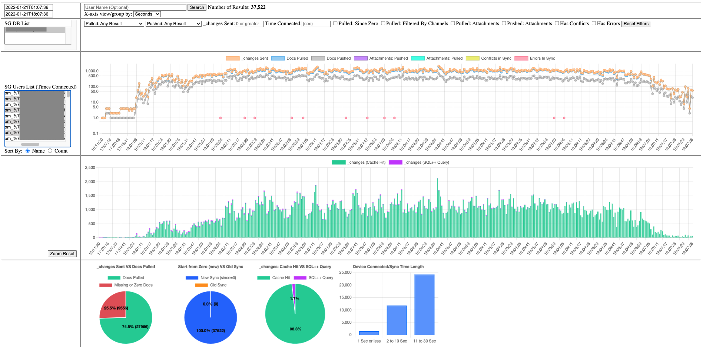

# SG Log Reader Demo

  

    I created this tool to be able to debug SG issue by getting a local copy of a SG's `sg_info.log` file and parsing it on my local machine to see whats going on in the SG. There are two parts to this script.

1. Parse and process the `sg_info.log` file and inserting the results in to a CB bucket.
 
2. Run a local web server to view an interactive dashboard of the results.

&#8678; Go through all the <b> Steps 1 to 4 </b> on the left side bar <b>or</b> bottom links to the <i>next page</i> to get up and running.

- SG = Sync Gateway
- CBL = Couchbase Lites
- CB = Couchbases
  
  

  

   
  

  

<b>NEW</b>

version 2.1.0
- macOS executable

Future - More
In the future this will do more features to better understand other things going on inside SG. If you are wanting a new feature or there is a bug click here to report it: [SG Log Reader Demo - Issues](https://github.com/Fujio-Turner/sg-log-reader-demo/issues)
  
  

  

  <b>Notes</b>

-- Its advised to "Flush" the Couchbase Bucket for each new SG environments you process. Example: Dev , QA or Prod so you don't get them mixed results in the dashboard.

-- Logs from a SG machine running on MS Windows might have issues as its timestamps in the logs might have a different format thus effecting the processing of SG file.
  

  <!-- Add more divs as needed -->

Click here to [Back To: SG Log Reader Demo - Github Repo](https://github.com/fujio-turner/sg-log-reader-demo)

Works on My Computer Tested & Certified ;-)