### Using The Dashboard

 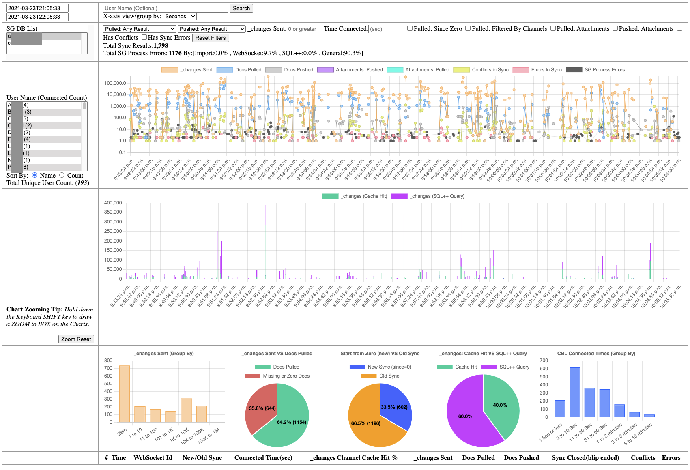

#### Search

 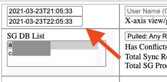
  

 
In the upper left hand corner there are two input boxes with a datetime range with a `FROM:` datetime and `TO:` datetime. This helps to narrow the search of the SG logs your interested in.

* The dashboard will auto pre-populate 
   - FROM DateTime input box (newest time record in the `sg_info.log` file) 
   - TO DateTime input box , an hour back from the above DateTime.
   - It will pre select a SG DB name too.

##### View By (All | Seconds | Minutes)

 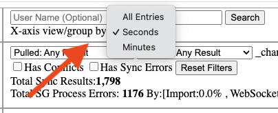
 

 
There might be many thousands of stats. So much so that plotting all of them will create web browser memory and CPU issues i.e. slow dashboard. To prevent this by default the stats in the charts are show `Group By: Seconds`. So every value on the x-axis shows everything in that one second time frame. You can also show all the entries OR group by minute too.

#### Filters

 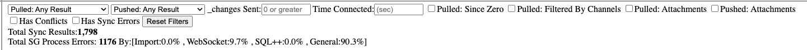
  

 
Be default the charts after clicking the <button>Search</button> button will show you all the results. You can filter the results by:

- Pulled: Any Results Syncs , All/Fully Syncs , Missing Docs Only Syncs or No New Docs Only Syncs
- Pushed: CBL Pushed Docs: Any Results Syncs , Zero Docs Pushed or Pushed 1 or More Docs
- _changes Sent: Syncs that sent (INT) \# of _changes or more to CBL.
- Length of Time CBL Connected (seconds)**
- Pulled: New vs Old Sync via (since = Zero)
- Pulled Filtered By: Only syncs that CBL applied a channel(s) filter on.
- Pulled w/ attachements: Only syncs that CBL recieved an attachement(s)
- Pushed w/ attachements: Only syncs that CBL pushed with an attachement(s)
- Conflicts in Sync: Syncs with some type of conflict during sync
- Errors in Sync: Syncs with some type of error in the sync.
- Rest All Filters to Defualts: <button>Reset Filters</button> 

Click the <button>Search</button> to get new filtered results.

**This does not necessarily mean how long it took to sync.

#### Picking a Specific User

##### User List:

 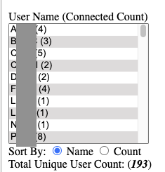
 

On the left it will show you all the SG users who made connections in the DatesTime window selected above plus how many times they connected in that time window. 
You can sort the list by:
 - alphabetically <i>(default)</i> 
 - by most \# of connections per user.

##### Click User Name:

 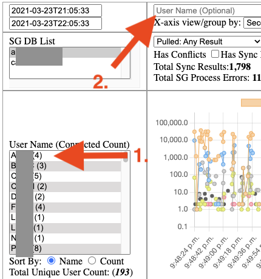
 

Just click the name of the user and it will pre populate the filter by username input box ,above, and then just click <button>Search</button> to filter and populate charts and stats for that user only.

***note*** When you pick and <button>Search</button> by a users the chart will plot `All Entries` on the x-axis regardless if you didn't change the `view by` dropdown value.

##### User Details:

Once you <button>Search</button> by a user on the bottom it will show you all the indivudal replication events for that user for that DateTime. If you click on the row it will show the full raw SG log for the WebSocket ID.

#### Charts/Graph

##### Sync Details & Errors - LINE Chart

 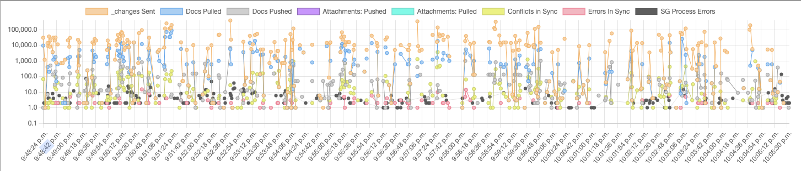
 

This chart is in log scale with DateTime on the x-axis.

- 1st.(Orange) shows the Total \# of _changes feed sent to CBL.
- 2nd.(Blue) shows the Total \# of documents pulled down by CBL.
   - In theory you would want both the 1st & 2nd to be the same (Full PULL Sync)
- 3rd.(Grey) shows the Total \# of Docs Pushed from CBL.
- 4th.(Purple) shows the Total \# of Atttachements Pushed from CBL.
- 5th.(Teal) shows the Total \# of Attachements Pulled down to CBL.
- 6th.(Yellow) shows the total \# of Conflicts in the sync with CBL.
- 7th.(Red) shows the Total \# of Errors in the sync with CBL.
- 8th.(Black) show the Total \# of SG Process errors.

HIDE DATA: Just click the color box of the item you don't want to show in the chart

##### Zoom-In & Pan (drag: left or right) - Charts
You can click on the line charts and PAN left or right by dragging it. If you hold down the `SHIFT` and select in the chart it will create a `zoom` box for you pick a section of the chart your more interesting in. There is a `Zoom Reset` button on the left. The two line charts will adjust themselves to the new x-axis on zoom and/or pan too.

##### _changes: Cache  vs Miss Hit - Bar Chart

 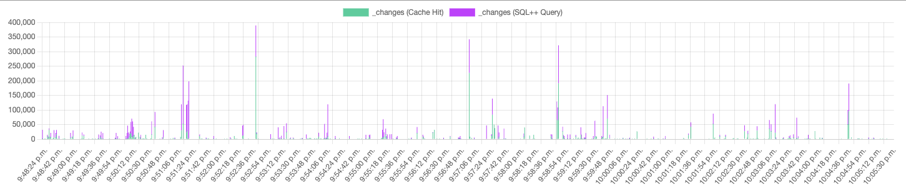
 

This chart gives insight into more of whats going on with the 1st charts `_changes sent` process. The _changes feed is the list of 'possible' changes that CBL might be interested in. This list is either retrieved from SG's local cache(HIT) and/or a SQL++(MISS) to Couchbase Server. The GREEN bar shows a HIT from SG's channel cache while PURPLE show MISS SQL++ against Couchbase.

##### _changes: GROUP BY Items Sent

 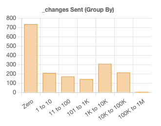
 

 This chart groups the number of items by 10X:

 - \# of _changes sent = Zero
 - \# of _changes sent = 1 to 10 changes sent
 - \# of _changes sent = 11 to 100 changes sent
 - \# of _changes sent = 101 to 1000 changes sent
 - ... etc to 10M

##### _changes: Fullly Sync vs Syncs Missing Docs

 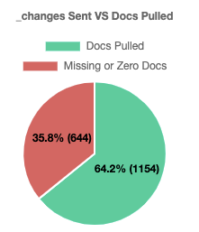
 

 This pie chart shows out of the total number of Syncs:

- Fully Sync, EX. 1,000 _changes items sent & Pulled down 1,000 docs
- Missing Sync , EX. 1,000 _changes items sent & Pulled down <b>50</b> docs 

NOTE: Ideally you would like this to be 100%(Fully Sync) but CBL might have conflicts locally that decides not to pull down some or all the docs.

##### Syncs: New vs Old Syncs

 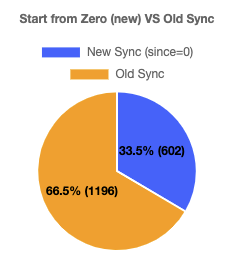
 

 This pie chart shows out of the total number of Sync :

- New Sync , EX. Started Sync from _changes since=0(zero)
- Old Sync , EX. Sync from _changes since=1000. CBL telling SG only give me _changes since the global sequence number of > 1,000.

##### _changes: Cache  vs Miss Hit - Pie Chart

 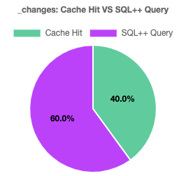
 

 This pie chart shows out of the total number of channel cache(_changes feed) :

- Hits: Local SG's Channel Cache (_changes feed)
- Misses: SQL++ queries

NOTE: By default when SG does a SQL++ for channel it gets 5,000 result every 1 second + has a scan consistency of "scan_plus".

##### Connected Time: GROUP BY Times

 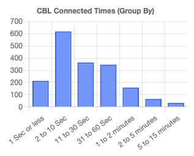
 

 This chart groups the number how long a replication is open by:

 - \# of _changes sent = 1 Second or Less
 - \# of _changes sent = 2 to 10 Seconds
 - \# of _changes sent = 11 to 30 Seconds
 - \# of _changes sent = 31 to 60 Seconds
 - \# of _changes sent = 1 to 2 Minutes
 - \# of _changes sent = 2 to 5 Minutes
 - ... etc to 1 hour or More

NOTE: Just because a CBL device is connected a "long" time doesn't mean it took all that time to sync. It could already have finished pull and pushing data in seconds but has a continuous replication waiting for newest changes.

#### Bugs & New Feature Requests

If you are wanting a new feature or there is a bug click here to report it: [SG Log Reader Demo - Issues](https://github.com/Fujio-Turner/sg-log-reader-demo/issues)